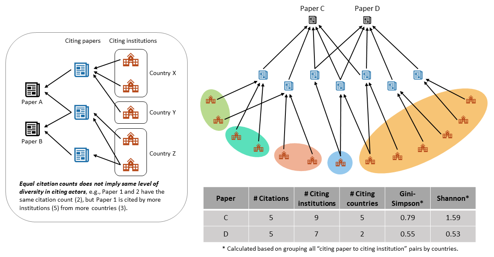

 

<!-- Title Page -->
<pdf:nexttemplate name="titlepage">

Open Access Research Outputs Receive More Diverse Citations

 DATE: {{ helper.created_at()|upper }}

<!-- switch page templates -->
<pdf:nexttemplate name="report">

<pdf:nextpage>

# Abstract

The goal of open access is to allow more people to read and use research outputs. An observed association between 
highly cited research outputs and open access has been claimed as evidence of increased usage of the research, but 
this remains controversial1,2. A higher citation count also does not necessarily imply a wider usage such as 
citations by authors from more places3,4,5. A knowledge gap exists in our understanding of who gets to use 
these research outputs and where users are located. Here we address this gap by examining the association between an 
output’s open access status and the diversity of research outputs that cite it. By analysing large-scale 
bibliographic data from 2010 to 2019, we found a robust association between open access and increased diversity of 
citation sources by institutions, countries, subregions, regions, and fields of research, across outputs with both 
high and medium-low citation counts. Open access through disciplinary or institutional repositories showed a 
stronger effect than open access via publisher platforms. This study represents a new perspective to our 
understanding of citations and provides crucial evidence at a global scale that open access is achieving its goals 
of research outputs being available to, and used by, wider audiences than closed research.

# Main

The purpose of research is for it to be used, either applied to solve problems and address issues, or more narrowly 
to provide insight, capacity and inspiration for further research. The open access (OA) movement is founded on the 
goals of putting research in the hands of more people and making it more usable (e.g., the Budapest OA 
Initiative6). A seismic shift in access models for scholarly outputs (i.e., from subscription-based 
models to OA models) has occurred over the past decade with accessible outputs (i.e. can be read or downloaded 
without payment) rising from approximately 27% of global outputs published in 2011 to over 49% of all outputs 
published in 2020 being accessible in some form7.

It remains challenging to conclusively demonstrate the benefits of this shift in access models for scholarly outputs.
The collection of case studies and narratives has been important in understanding the issue, and studies have sought 
quantitative evidence of enhanced usage via a variety of methods. Some studies observed associations between 
increased citation counts with OA have provided the most global evidence of enhanced article usage8,9,10. 
However, there are several confounding factors that weaken claims of a causal link2,11. Specifically, a 
set of narrowly defined randomised control trials find no effect in other studies, and there is an argument that 
access to academic resources and prestige may well be associated with both the choice to make an output OA and the 
likelihood of higher citations1,12,13,14,15.

In addition, we felt that the focus on citation counts fails to address the core goals of OA, specifically that a 
wider range of research users has more access. We need a different approach to quantify the impact of OA focusing on 
widening the diversity of users who are able to access scholarly content. Recent advances in data availability and 
processing has meant that we are now able to identify the affiliations of citing authors at scale and hence 
quantitatively assess the institutional and geographic diversity of citing authors globally. Similarly, we are able 
to analyse the fields of research across citing outputs. We refer to these measures under one umbrella term: 
*citation diversity*. We quantify citation diversity using two different standard measures of diversity that are less 
sensitive to citation counts. This helps us to address the issues of access to resources and prestige that are 
potential confounders1,12,13,14,15 in analyses based simply on citation counts which remain with more 
sophisticated measures such as citation velocity, as shown in previous research16,17.

To analyse citation diversity we used the data workflows and datasets developed by the Curtin Open Knowledge 
Initiative for analysis of open knowledge performance18. For the current analysis we used an integrated 
dataset that combines data from Crossref, Microsoft Academic Graph (MAG) and the Research Organization Registry (ROR)
to provide information on affiliations and geographical locations, fields of research, and publication dates. We 
used data from Unpaywall to define OA status of individual outputs.

For our analysis we extracted all relevant research outputs with publication years from 2010 to 2019  (see Methods 
for details). For each of the 19 million outputs, we extracted citation counts (from the total of 420 million 
citation links), metadata of their citing outputs and citing author affiliations, and calculated the Shannon Entropy 
(or Shannon Index) and the Gini-Simpson Index (or Gini’s Diversity Index) as measures of citation diversity. Higher 
scores for these indices are indicators of more citation diversity. We consider citation diversity based on five 
different ways of grouping citation links - by institutions, countries, subregions, regions, and fields of research 
(i.e., citing groups). Fig. 1 demonstrates how citation diversity assessed using these indices is different from 
traditional citation counts. Two outputs having equal citation counts does not imply they have the same level of 
diversity in citing groups such as citations from a number of different institutions. 

# Methods

# References

1. Lewis, C. L. The open access citation advantage: Does it exist and what does it mean for libraries? Information 
   Technology and Libraries 37(3), 50-65 (2018). https://doi.org/10.6017/ital.v37i3.10604
2. Basson, I., Blanckenberg, J. P., & Prozesky, H. Do open access journal articles experience a citation advantage? 
   Results and methodological reflections of an application of multiple measures to an analysis by WoS subject areas.
   Scientometrics 126, 459-484 (2021). https://doi.org/10.1007/s11192-020-03734-9
3. Dahler-Larsen, P. Making citations of publications in languages other than English visible: On the feasibility of 
   a PLOTE-index. Research Evaluation 27(3), 212-221 (2018) https://doi.org/10.1093/reseval/rvy010
4. Linkov, V., O’Doherty, K., Choi, E., & Han, G. Linguistic Diversity Index: A Scientometric Measure to Enhance the 
   Relevance of Small and Minority Group Languages. SAGE Open 11(2), 1-9 (2021). https://doi.org/10.
   1177/21582440211009191
5. Neylon, C., Ozaygen, A., Montgomery, L., Huang, C-K., Pyne, R., Lucraft, M., & Emery, C. More Readers in More 
   Places: The Benefits of Open Access for Scholarly Books. Insights 34 (1): 27 (2021). http://doi.org/10.1629/uksg.558
6. Chan, L., et al. Read the Declaration - Budapest Open Access Initiative (2002). Retrieved September, 6, 2022 from 
   https://www.budapestopenaccessinitiative.org/read/
7. Neylon, C., & Huang, C-K. The Global State of Open Access 2021. Zenodo (2022). https://doi.org/10.5281/zenodo.7059176
8. Piwowar, H., Priem, J., Larivière, V., Alperin, J. P., Matthias, L., Norlander, B., Farley, A., West, J., & 
   Haustein, S. The state of OA: a large-scale analysis of the prevalence and impact of Open Access articles. PeerJ 
   6, e4375 (2018). https://doi.org/10.7717/peerj.4375
9. Archambault, E., Amyot, D., Deschamps, P., Nicol, A., Provencher, F., Rebout, L., & Roberge, G. Proportion of 
   open access papers published in peer-reviewed journals at the European and world level—1996–2013. 
   RTD-B6-PP-2011-2: Study to develop a set of indicators to measure open access. Report. Science-Metrix (2014). 
   Retrieved August 19, 2022 from https://science-metrix.com/sites/default/files/science-metrix/publications/d_1.
   8_sm_ec_dg-rtd_proportion_oa_1996-2013_v11p.pdf. 
10. Bautista-Puig, N., Lopez-Illescas, C., de Moya-Anegon, F., Guerrero-Bote, V., & Moed, H. F.. Do journals 
    flipping to gold open access show an OA citation or publication advantage?. Scientometrics 124, 2551–2575 (2020).
    https://doi.org/10.1007/s11192-020-03546-x
11. Dorta-González, P., González-Betancor, S.M. & Dorta-González, M.I. Reconsidering the gold open access citation 
    advantage postulate in a multidisciplinary context: an analysis of the subject categories in the Web of Science 
    database 2009–2014. Scientometrics 112, 877–901 (2017). https://doi.org/10.1007/s11192-017-2422-y
12. Sotudeh, H. Does open access citation advantage depend on paper topics? Journal of Information Science 46(5), 
    696-709. (2020). https://doi.org/10.1177/0165551519865489
13. Hua, F., Sun, H., Walsh, T., Worthington, H., & Glenny, A. Open access to journal articles in dentistry: 
    Prevalence and citation impact. Journal of Dentistry 47, 41-48 (2016). https://doi.org/10.1016/j.jdent.2016.02.005
14. Davis, P. M. Open access, readership, citations: a randomized controlled trial of scientific journal publishing. 
    The FASEB Journal 25(7), 2129-2134 (2011). https://doi.org/10.1096/fj.11-183988
15. Zhang, L., & Watson, E. M. Measuring the Impact of Gold and Green Open Access. The Journal of Academic 
    Librarianship 43(4), 337-345. (2017). https://doi.org/10.1016/j.acalib.2017.06.004
16. Hutchins, B. I., Yuan, X., Anderson, J. M., & Santangelo, G. M. Relative Citation Ratio (RCR): A New Metric That 
    Uses Citation Rates to Measure Influence at the Article Level. PLoS Biology 14(9), e1002541 (2016). https://doi.
    org/10.1371/journal.pbio.1002541
17. Seppänen, J-T., Värri, H, & Ylönen, I. Co-citation Percentile Rank and JYUcite: a new network-standardized 
    output-level citation influence metric and its implementation using Dimensions API. Scientometrics 127, 
    3523-3541. (2022). https://doi.org/10.1007/s11192-022-04393-8
18. Hosking, R., Diprose, J. P., Roelofs, A., Chien, T-Y., Handcock, R. N., Kramer, B., Napier, K., Montgomery, L., 
    & Neylon, C. Academic Observatory Workflows [Software]. Zenodo (2022). https://doi.org/10.5281/zenodo.6366694
19. The World Bank. Research and development expenditure (% of GDP). World Bank Group (2022). Retrieved September 6, 
    2022 from https://data.worldbank.org/indicator/GB.XPD.RSDV.GD.ZS

